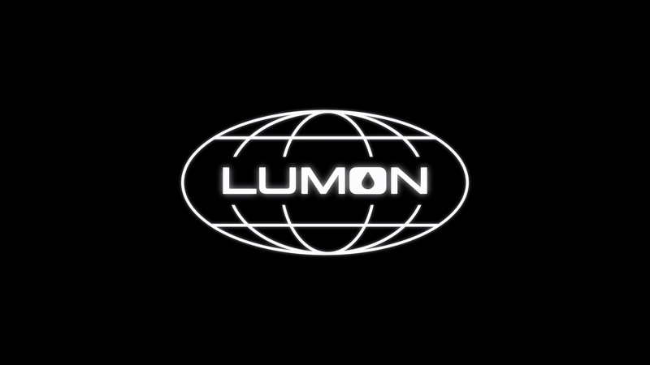

<div align="center">

# Lumon Plymouth theme

**The Lumon globe from *Severance* as your Linux boot splash.**

[Install](#install) · [Customize](#customize) · [Uninstall](#uninstall)



</div>

A [Plymouth](https://gitlab.freedesktop.org/plymouth/plymouth) theme that plays the Lumon Industries logo animation while your machine boots and shuts down. It's one short Plymouth script and a folder of PNG frames, so it works on any distribution that boots with Plymouth.

- **Draws itself in:** a 6.7-second loop at 25 fps. The globe traces its lines, then the wordmark fades in with a soft glow.
- **Stays centered:** the 1080×1080 frames are re-centered on every refresh, so a resolution change mid-boot doesn't knock it off-center.
- **Boot and shutdown:** Plymouth shows the same theme for both.
- **One-command install:** `install.sh` copies the files, sets the theme and rebuilds your initramfs.

> [!NOTE]
> Plymouth must already be installed and enabled at boot (for example, `splash` on your kernel command line). Installing needs root; the one-liner also needs `curl` and `git`.

## Install

One line. It clones the repo to a temporary folder and runs the installer as root:

```bash
curl -sSL https://raw.githubusercontent.com/kudayyurter/PlymouthLumonSplash/main/install.sh | sudo bash
```

Or from a clone:

```bash
git clone https://github.com/kudayyurter/PlymouthLumonSplash.git
cd PlymouthLumonSplash
sudo ./install.sh
```

Reboot to see it. Running `plymouth-set-default-theme` with no arguments prints the active theme, which should now be `lumon`.

<details><summary>Install by hand (if the script doesn't suit your distribution)</summary>

```bash
sudo mkdir -p /usr/share/plymouth/themes/lumon
sudo cp contents/splash/*.png contents/splash/lumon.plymouth contents/splash/lumon.script /usr/share/plymouth/themes/lumon/
sudo plymouth-set-default-theme -R lumon
```

`-R` rebuilds the initramfs. If yours isn't rebuilt that way, run your distribution's tool yourself, for example on Arch with mkinitcpio:

```bash
sudo mkinitcpio -P
```

</details>

## Customize

The theme lives in [`contents/splash/`](contents/splash/):

| File | What it is |
|---|---|
| [`lumon.plymouth`](contents/splash/lumon.plymouth) | Theme metadata; tells Plymouth to run the script from `/usr/share/plymouth/themes/lumon` |
| [`lumon.script`](contents/splash/lumon.script) | Loads the frames and swaps them on each refresh, centered on screen |
| `frame-*.png` | The animation: 168 numbered frames, 1080×1080 on black |

Two settings at the top of `lumon.script` control playback:

| Setting | Default | What it does |
|---|---|---|
| `speed_factor` | `2` | Refreshes per frame. Plymouth refreshes at 50 Hz, so `1` is 50 fps, `2` is 25 fps, `3` is about 16 fps. |
| `total_frames` | `168` | How many frames to load and loop: plays `frame-0.png` through `frame-167.png`. Change it if you swap in your own frames. |

Edit the files in the repo and re-run `sudo ./install.sh`, which copies them over and rebuilds the initramfs.

## Uninstall

```bash
plymouth-set-default-theme --list                          # themes you have installed
sudo plymouth-set-default-theme --reset --rebuild-initrd   # back to your distribution's default
sudo rm -r /usr/share/plymouth/themes/lumon
```

To pick a specific theme instead of the default, use `sudo plymouth-set-default-theme -R <name>`.

## Credits and license

A fan project inspired by Lumon Industries from *Severance*; not affiliated with Apple TV+. Code is [MIT](LICENSE); the Lumon name and logo belong to their owners.

*Created with care for the Lumon Industries family.*
